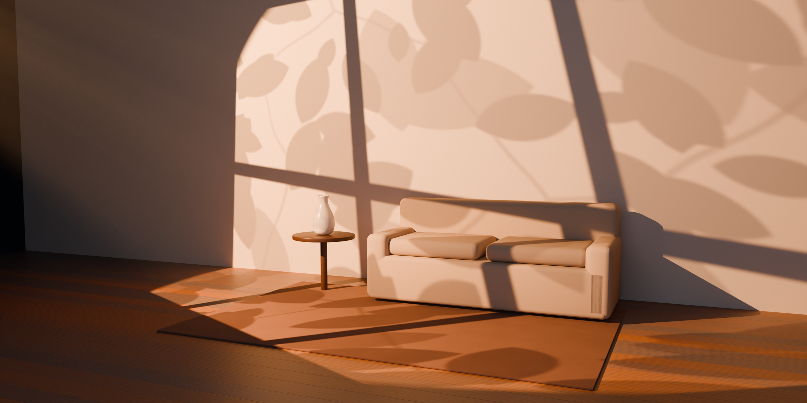
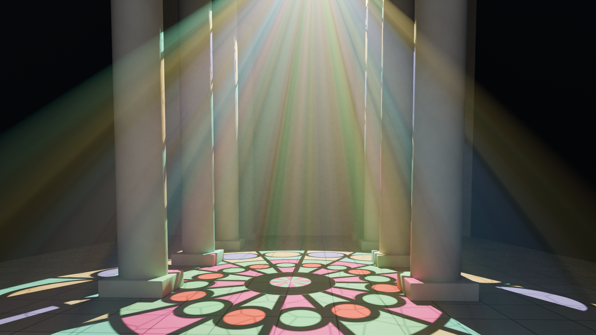
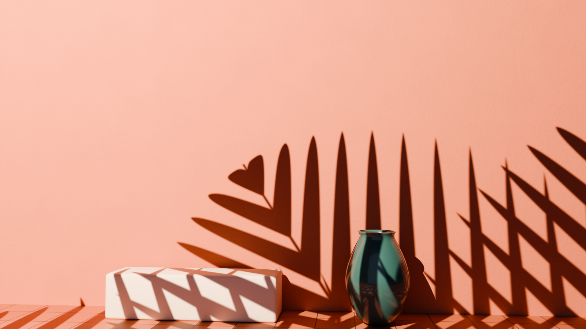
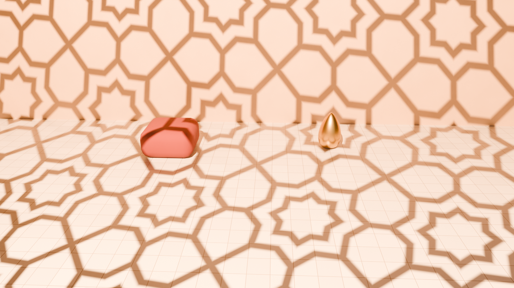
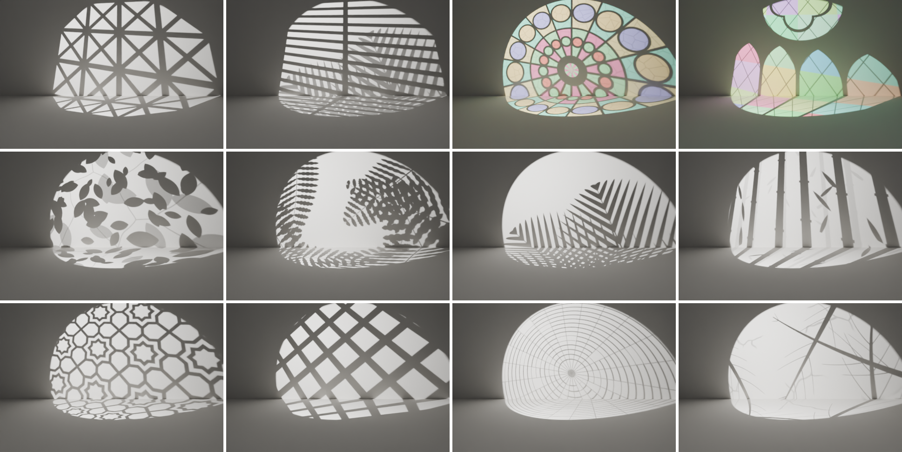
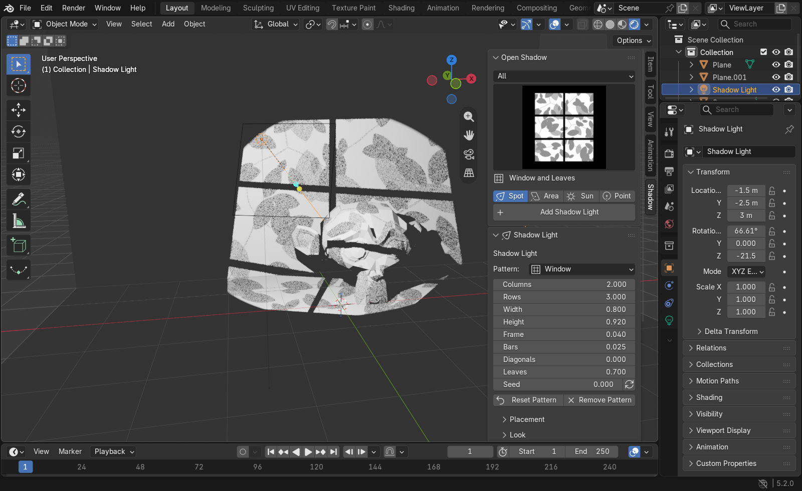
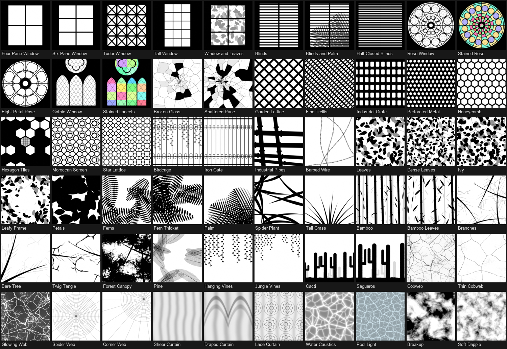

# Open Shadow

**Free, open source gobo lights for Blender.** Cast the shadow of a window,
blinds, leaves, ferns, a palm, bamboo, branches, a lattice, a rose window,
a spider web and more onto your scene with one click.

- **25 procedural patterns and 60 presets.** Everything is built from shader
  nodes, so there are no image textures: shadows stay sharp at any size, and
  every pattern has its own settings and a random seed.
- Works in **Cycles and EEVEE**, including the rendered viewport.
- **Stained glass casts coloured light** in Cycles.
- Use **your own image** as a gobo too.
- Files keep rendering without the add-on installed.

| | |
| --- | --- |
|  |  |
|  |  |

## How it works

A shadow light is an ordinary lamp with a hidden plane in front of it. The
plane is invisible to the camera and to reflections. It only blocks light,
through a material whose transparency is the pattern. That is how a real gobo
(a cut metal or glass disc in a stage light) works, so it behaves the same way:

- The plane follows the lamp. Move, rotate or animate the lamp as usual.
- With a **Spot** lamp, the pattern always fills the cone.
- **Focus Distance** is the distance from the lamp to the pattern. A larger
  distance gives sharper shadows.
- **Softness** is the lamp's radius (or the sun's angle). It blurs the
  shadow exactly as it would in real life.

Python-free drivers keep the plane in place and sized to the lamp, so files
work without the add-on and without *Auto Run Python Scripts*.

## Patterns

| Group | Patterns |
| --- | --- |
| Windows | Window (panes, bars, Tudor diagonals, leaves outside), Blinds (with palm fronds), Rose Window, Gothic Window, Broken Glass |
| Screens | Grid / Lattice (trellis, grate, perforated metal), Honeycomb, Moroccan, Iron Gate / Birdcage, Pipes, Barbed Wire |
| Plants | Leaves (ivy, dense, petals, leafy frame), Fern, Palm, Blades (spider plant, grass), Bamboo, Branches (bare tree, twig tangle, forest canopy), Pine, Hanging Vines, Cacti |
| Other | Cobweb, Spider Web, Curtain (sheer, draped, lace), Caustics, Breakup |
| Custom | Image (white lets light through, black blocks it) |

## Install

1. Download `open_shadow-x.y.z.zip` from the [Releases](../../releases) page.
   Don't unzip it.
2. In Blender (4.5 or newer), go to *Edit → Preferences → Get Extensions*, open the **⌄**
   menu at the top right, choose **Install from Disk…**, and pick the zip.

## Use

Everything is in the 3D Viewport: **Sidebar (N) → Shadow**. *Add → Light →
Add Shadow Light* works too.

- **Open Shadow**: pick a category and a preset, a lamp type (Spot, Area, Sun
  or Point), then click *Add Shadow Light*. The new lamp is aimed at the 3D
  cursor. With a lamp selected that has no pattern, *Add Pattern to Light*
  turns it into a shadow light.
  - Picking a preset while a shadow light is active changes that light.
- **Shadow Light** (shown when a shadow light is active):
  - *Pattern* and its settings. The ⟳ button next to *Seed* gives a new
    random variation.
  - *Placement*: focus distance, pattern size (Sun, Area and Point lamps),
    scale, rotation, offset and flip.
  - *Look*: strength, invert, contrast, tint, and a round *Iris* to cut
    the pattern to a circle.
  - *Lamp*: type, colour, power, cone, softness, and *Aim at Cursor*.
- **Scene**: *Haze* fills the world with a thin volume so the light draws
  visible beams. It also lists every shadow light in the scene.

### Tips

- **Sun** lamps make the classic "sunlight through a window" look: the
  shadow is parallel, and *Pattern Size* sets how large the window is.
  Place the lamp near the area it lights.
- **Spot** lamps make projector-style light: the pattern fills the cone and
  grows with distance.
- For crisp shadows keep *Softness* low and *Focus Distance* high. For the
  soft, out-of-focus look of leaves outside a window, do the opposite.
- In EEVEE, see-through parts of a pattern (curtains, faint leaves) are
  rendered by dithering and get smoother with more samples. Coloured shadows
  need Cycles; EEVEE shadows are grey. For accurate soft shadows in EEVEE,
  turn on *Accurate Soft Shadows* in the *Lamp* panel.
- Duplicating a shadow light shares its pattern with the copy. Click
  *Make Unique* to edit them separately.

## License

GPL-3.0-or-later. See [LICENSE](LICENSE). Everything Open Shadow generates
is yours to use without restriction.
